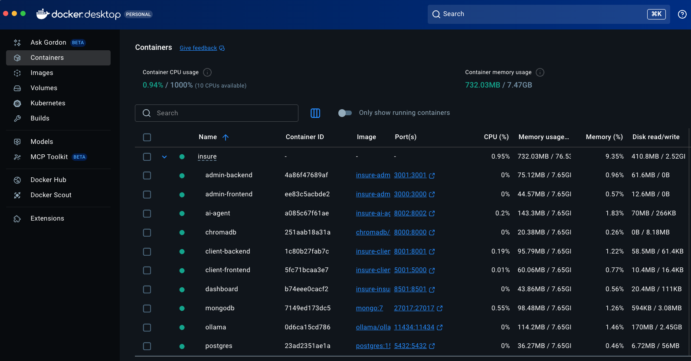

<div>
  
  <h1 style="display: inline; vertical-align: middle; margin: 0;">AI Agent Insure - Application Platform</h1>
</div>

<br />A full-stack Agentic RAG (Retrieval-Augmented Generation) application for insurance operations, featuring intelligent query routing across multiple data sources, multimodal chat interfaces, and comprehensive admin and client portals.

## 🎯 Project Overview

The AI Agent Insure Application Platform is a production-ready insurance management system that combines:
- **Structured Data** (PostgreSQL) - Policies, claims, customers, risk profiles
- **Document Knowledge Base** (ChromaDB) - Company information, products, procedures
- **User Data** (MongoDB) - User profiles and query history
- **AI Agent** - Intelligent query routing and RAG-powered question answering

### Key Features

- 🤖 **Intelligent Query Routing** - Automatically routes queries to SQL, RAG, or Hybrid processing
- 💬 **Multimodal Chat Interface** - Text and speech input/output for both admin and client users
- 📊 **Admin Dashboard** - Professional Next.js dashboard for support personnel
- 👤 **Client Portal** - Modern customer-facing portal with policy management
- 📄 **PDF Document Upload** - Upload and ingest PDFs into the knowledge base
- 🔄 **CSV Data Refresh** - Refresh database from CSV files via API
- ⚡ **Performance Optimized** - Query caching, connection pooling, and optimized database queries
- 🔒 **Role-Based Access Control** - Admin, authenticated client, and guest user permissions

## 🏗️ Architecture

### System Components

```
┌─────────────────────────────────────────────────────────────┐
│                    Frontend Applications                    │
├──────────────────────┬──────────────────────────────────────┤
│  Admin Frontend      │      Client Frontend                 │
│  (Next.js)           │      (Flask)                         │
│  Port: 3000          │      Port: 5001                      │
└──────────┬───────────┴──────────────┬───────────────────────┘
           │                          │
           ▼                          ▼
┌──────────────────────┬──────────────────────────────────────┐
│  Admin Backend       │      Client Backend                  │
│  (Express/TypeScript)│      (FastAPI)                       │
│  Port: 3001          │      Port: 8001                      │
└──────────┬───────────┴──────────────┬───────────────────────┘
           │                          │
           └───────────┬──────────────┘
                       │
                       ▼
           ┌───────────────────────┐
           │     AI Agent API      │
           │     (FastAPI)         │
           │     Port: 8002        │
           └───────────┬───────────┘
                       │
        ┌──────────────┼──────────────┐
        │              │              │
        ▼              ▼              ▼
┌─────────────┐ ┌─────────────┐ ┌─────────────┐
│ PostgreSQL  │ │  MongoDB    │ │  ChromaDB   │
│ Port: 5432  │ │  Port: 27017│ │  Port: 8000 │
└─────────────┘ └─────────────┘ └──────┬──────┘
                                       │
                                       ▼
                                 ┌─────────────┐
                                 │   Ollama    │
                                 │  Port: 11434│
                                 └─────────────┘
```

### Deployed Containers



*All services running in Docker containers with health monitoring*

### Data Flow

1. **User Query** → Frontend (Admin or Client)
2. **API Request** → Backend (Admin or Client)
3. **Query Routing** → AI Agent (intelligent routing)
4. **Data Retrieval** → PostgreSQL, MongoDB, or ChromaDB
5. **LLM Processing** → Ollama (phi3:mini model)
6. **Response Generation** → Streaming response to frontend
7. **Query Logging** → MongoDB (for authenticated users)

## 🚀 Quick Start

### Prerequisites

- Docker installed and running
- 8GB+ RAM (for Ollama and ChromaDB)
- macOS, Linux, or Windows with WSL2 (*Built and tested on M1 Mac)

### Installation

1. **Clone the repository**
   ```bash
   git clone <repository-url>
   git checkout feature/refactor-ai-agent-insure-platform
   cd AI_Agent_Insure
   ```
   
   > **Note**: This implementation is in the `feature/refactor-ai-agent-insure-platform` branch of the repository. Changes have not been merged to the `main` branch to preserve the base code and keep it in sync with the final project requirements and videos in the accompanying [YouTube playlist](https://www.youtube.com/playlist?list=PLRBkbp6t5gM12JGRlbGomEETO2RknoRbP).

2. **Create environment file**
   ```bash
   cp .env.example .env
   # Edit .env with your configuration (see Environment Setup Guide)
   ```

3. **Deploy the platform**
   ```bash
   ./deploy.sh
   ```

4. **Access the applications**
   - Systems Dashboard: [http://localhost:8501](http://localhost:8501)
   
   - Admin Dashboard: [http://localhost:3000](http://localhost:3000)
   - Admin API Docs: [http://localhost:3001/docs](http://localhost:3001/docs)
   
   - Client Portal: [http://localhost:5001](http://localhost:5001)
   - Client API Docs: [http://localhost:8001/docs](http://localhost:8001/docs)
   
   - AI Agent API Docs: [http://localhost:8002/docs](http://localhost:8002/docs)

### Default Credentials

See the [Environment Setup Guide](docs/ENVIRONMENT_SETUP.md) for default credentials and configuration.

## 📚 Documentation

- **[Environment Setup Guide](docs/ENVIRONMENT_SETUP.md)** - Configuration and environment variables
- **[Deployment Guide](docs/DEPLOYMENT.md)** - Detailed deployment instructions
- **[API Documentation](docs/API_DOCUMENTATION.md)** - Complete API endpoint reference
- **[Architecture Diagrams](docs/ARCHITECTURE.md)** - System architecture and data flow

## 🛠️ Technology Stack

### Frontend
- **Admin Frontend**: Next.js 16, TypeScript, Tailwind CSS, Shadcn/UI
- **Client Frontend**: Flask, Jinja2, Tailwind CSS
- **Dashboard**: Streamlit

### Backend
- **Admin Backend**: Express.js, TypeScript, PostgreSQL
- **Client Backend**: FastAPI, Python, PostgreSQL, MongoDB
- **AI Agent**: FastAPI, Python, RAG Engine

### Databases
- **PostgreSQL 15**: Structured data (policies, claims, customers)
- **MongoDB 7**: User profiles and query history
- **ChromaDB**: Vector store for document embeddings

### AI/ML
- **Ollama**: Local LLM inference (phi3:mini)
- **Embeddings**: nomic-embed-text
- **RAG**: Custom RAG engine with intelligent routing

### Infrastructure
- **Docker & Docker Compose**: Containerization
- **Health Checks**: Service monitoring
- **Connection Pooling**: Optimized database connections

## 📁 Project Structure

```
AI_Agent_Insure/
├── admin-app/
│   ├── backend/          # Express/TypeScript API
│   └── frontend/         # Next.js dashboard
├── client-app/
│   ├── backend/          # FastAPI service
│   └── frontend/         # Flask portal
├── ai-agent/             # RAG agent service
├── database-init/        # Database initialization scripts
├── data/
│   ├── insured_data/    # CSV data files
│   └── knowledge-base/  # PDF documents
├── insure-dashboard/    # Streamlit systems dashboard
├── deploy.sh            # Deployment script
├── destroy.sh           # Cleanup script
└── docker-compose.yml   # Service orchestration
```

## 🔑 Key Features

### Intelligent Query Routing

The AI Agent automatically routes queries to the appropriate data source:

- **SQL Queries**: Structured data (insureds, policies, claims, statistics)
- **RAG Queries**: Document-based queries (company info, products, procedures)
- **Hybrid Queries**: Combines SQL and RAG for comprehensive answers
- **MongoDB Queries**: User profile information

### Access Control

- **Admin Users**: Full access to all data sources
- **Authenticated Clients**: Access to their own policy data + RAG
- **Guest Users**: RAG-only access (no database queries)

### Performance Features

- Query caching (5-minute TTL)
- Connection pooling (PostgreSQL: 20, MongoDB: 50)
- LRU caching for database count operations
- Streaming responses for real-time chat

## 🧪 Testing

### Run All Tests
```bash
./deploy.sh  # Includes test execution
```

## 📊 Services & Ports

| Service | Port | Description |
|---------|------|-------------|
| Admin Frontend | 3000 | Next.js dashboard |
| Admin Backend | 3001 | Express API |
| Client Frontend | 5001 | Flask portal |
| Client Backend | 8001 | FastAPI service |
| AI Agent | 8002 | RAG agent API |
| PostgreSQL | 5432 | Relational database |
| MongoDB | 27017 | Document database |
| ChromaDB | 8000 | Vector store |
| Ollama | 11434 | LLM service |
| Systems Dashboard | 8501 | Streamlit dashboard |

## 📚 Data updates

1. **PDF Upload**: Use the `/documents` page in admin frontend or `POST /api/agent/upload/pdf`
2. **CSV Refresh**: Use `POST /api/data/refresh` or run `./refresh_db.sh`

---

<br />**Last Updated**: December 2025  
**Version**: 1.0.0  
