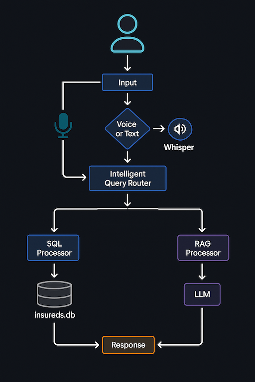
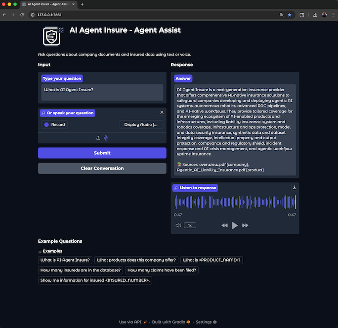
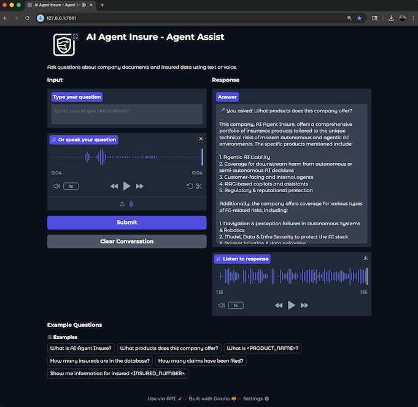

# 🎓 CSCI_E-89_Deep_Learning_Fall_25

Repo for the CSCI E-89 Deep Learning Final Project (Fall '25, Harvard Extension School)

## 📚 Course Information

- **Course**: [CSCI E-89 Deep Learning](https://coursebrowser.dce.harvard.edu/course/deep-learning/)
- **Professors**: [Prof. Zoran B. Djordjević](https://coursebrowser.dce.harvard.edu/course/deep-learning/#zoran-djordjevic) & [Prof. Rahul Joglekar](https://coursebrowser.dce.harvard.edu/course/deep-learning/#rahul-joglekar)
- **Student**: [Robert Frenette](https://www.linkedin.com/in/robertmfrenette/)

## 🤖 Project Information

- **Project**: Local Assistant (LLM & RAG)
- **Description**: A local assistant leveraging large language models (LLMs) and retrieval-augmented generation (RAG) techniques to provide contextual assistance and information retrieval.

## 🎬 Video Links

- Intro: TBD
- [Demo](https://youtu.be/V0mAQjiUK6Q)
- [Local Setup and Execution](https://youtu.be/Z-3NUKS5HLE)
- Code Walkthrough: TBD

## 🛠️ Technologies Used

- [Ollama](https://ollama.com/): Local LLM hosting server
- [llama3.2:3b](https://ollama.com/library/llama3.2): LLM
- [nomic-embed-text](https://ollama.com/library/nomic-embed-text): Embedding Model
- [LangChain](https://langchain.com/): Framework for developing applications powered by language models
- [Chroma](https://www.trychroma.com/): Vector database for storing and retrieving embeddings
- [Gradio](https://gradio.app/): Framework for building machine learning and data science web apps

## 📖 Resources

- 📗 [Ollama Crash Course: Build Local LLM powered Apps](https://www.amazon.com/Ollama-Crash-Course-Build-powered/dp/B0DXFVV41K)
- 📗 [Build a Large Language Model (From Scratch)](https://www.amazon.com/Build-Large-Language-Model-Scratch/dp/1633437167)
- 📗 [Agentic AI Systems with LangChain + MCP + RAG + Ollama: Build Real-World Intelligent Agents with Modular Tools, Local LLMs, and Retrieval-Augmented Reasoning](https://www.amazon.com/dp/B0F6KRKH2D)

## 🚀 Quick Start / Setup

### Prerequisites

1. **Python 3.12+** installed
2. **uv** package manager installed ([install instructions](https://github.com/astral-sh/uv))
3. **Ollama** running locally:
   ```bash
   ollama serve
   ```
4. Required Ollama models (will be pulled automatically if not present):
   - `llama3.2:3b` (for LLM inference)
   - `nomic-embed-text` (for embeddings)
5. **[ffmpeg](https://www.ffmpeg.org/)**: `brew install ffmpeg` (macOS)

### Initialization

The project includes an initialization script (`init.sh`) that sets up the entire environment and prepares all data.

**Configuration**: The application supports configuration via environment variables using a `.env` file. Before running the application, rename `sample.env.txt` in the project root to `.env`. See the `.env` file for customizable settings. All configuration values can be overridden without modifying code.

**Option 1: Execute Script (venv activated during execution only)**
```bash
./init.sh
# After completion, activate venv manually:
source .venv/bin/activate
```

**Option 2: Source Script (venv remains active after completion)**
```bash
source init.sh
# Venv is already activated after completion
```

The script will:
1. Clean up existing `.venv`, `__pycache__`, logs, and databases
2. Create virtual environment (`uv venv --python python3.12`)
3. Install dependencies (`uv pip install -r requirements.txt`)
4. Create SQLite database (`insured-db/insureds.db`)
5. Create vector store (`vector-store/chroma_db/`)

### Running the Application

After initialization:

```bash
# Activate venv (if not already activated)
source .venv/bin/activate

# Run the application
cd agent
python app.py
```

The application will be available at `http://127.0.0.1:7861`

For detailed setup instructions and configuration options, see [`agent/README.md`](agent/README.md).

## 📂 Project Structure

### [`agent/`](agent/)

The main application directory containing the hybrid RAG chatbot. See [`agent/README.md`](agent/README.md) for detailed documentation.

- **Main Application**: `app.py` - Entry point for the chatbot
- **UI**: `ui.py` - Gradio interface separated from app logic
- **Configuration**: `config.py` - All settings (supports `.env` file)
- **Processors**: Domain processors for RAG, SQL, and audio processing
- **Routing**: Intelligent query routing (SQL vs RAG detection)
- **Logging**: Centralized logging configuration

---

### [`knowledge-base/`](knowledge-base/)

Source PDF documents used for RAG retrieval. Documents are organized by category:

- **company/**: Company overview and website information
- **products/**: Product brochures and coverage details
- **guides/**: Process guides (claims, underwriting, coverage boundaries)
- **agent_support/**: Agent support guides for various products
- **personnel/**: Organizational information

These PDFs are processed into embeddings stored in `vector-store/chroma_db/`.

---

### [`vector-store/`](vector-store/)

Vector database containing embeddings of all PDF documents. See [`vector-store/README.md`](vector-store/README.md) for details.

- **Creation Script**: `create_chroma_vectorstore.py` - Generates embeddings from PDFs
- **Database**: `chroma_db/` - Persistent ChromaDB storage (created by script)

---

### [`insured-db/`](insured-db/)

SQLite database containing structured insurance data. See [`insured-db/README.md`](insured-db/README.md) for schema details.

- **Creation Script**: `create_and_seed_insureds_db.py` - Creates database from CSV files
- **Database**: `insureds.db` - SQLite database with 100 insureds, 208 policies, 46 claims
- **Source Data**: `insured_data/` - CSV files used to seed the database

---

### [`agent-eval/`](agent-eval/)

Evaluation framework for testing RAG and SQL query systems. See [`agent-eval/README.md`](agent-eval/README.md) for usage.

- **Test Script**: `test.py` - Runs evaluation tests
- **Evaluation Logic**: `eval.py` - Core evaluation functions
- **Test Data**: `test_data.json` - Test cases (6 RAG + 4 SQL = 10 total)
- **Results**: `results/` - JSON test results with timestamps
- **Analysis**: `analysis.ipynb` - Jupyter notebook for visualizing results

## 📄 PDF Documents (for RAG)

- PDF documents for this project contain fictitious data (created using an LLM) and are solely for demonstrative purposes.

## 🏗️ High-Level Architecture Diagram



## 📸 Screenshots

#### 💬 Text Query

[](img/text-query.png)


#### 🎤 Audio Query

[](img/audio-query.png)

---

#### Credit: This markdown file was generated by 🤖 GitHub Copilot.
